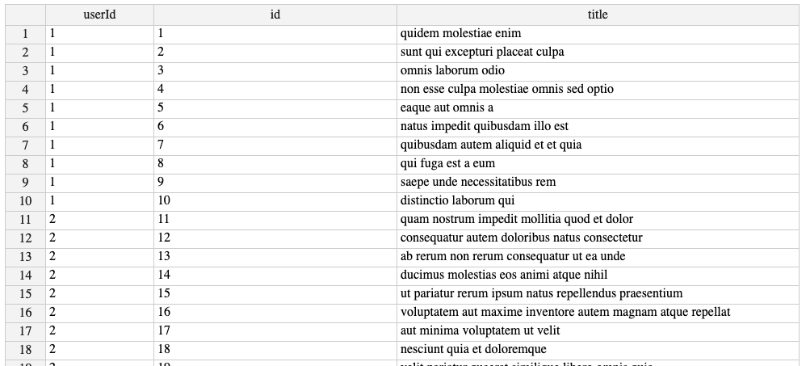

# Concurrency: The Workers Pool

Workers pool and jobs queue implementation to make http request and write it into csv file.

## Usages

| No | Flag             | Descriptions                                    |
|----|------------------|-------------------------------------------------|
| 1  | output           | directory for exported csv, default: "exports/" |
| 2  | concurrent_limit | number of workers, default: 2                   |
| 3  | jobs             | job list, default: jobs.json                    |

### Example

```sh
./concurrency -concurrent_limit=8 -jobs=myjobs.json -output=exports/
```

output:

```sh
2020/11/15 02:23:58 worker 4 : listening
2020/11/15 02:23:58 worker 1 : listening
2020/11/15 02:23:58 worker 6 : listening
2020/11/15 02:23:58 worker 0 : listening
2020/11/15 02:23:58 worker 5 : listening
2020/11/15 02:23:58 worker 2 : listening
2020/11/15 02:23:58 worker 3 : listening
2020/11/15 02:23:58 worker 7 : listening
2020/11/15 02:23:58 worker 4 : receiving job {https://jsonplaceholder.typicode.com/albums albums.csv exports/}
2020/11/15 02:23:59 worker 4 : was finished job {https://jsonplaceholder.typicode.com/albums albums.csv exports/}
...
```

the pool will keep running. to exit, press `CTRL + C` and wait for graceful shutdown process. once it finished, program will closed.

exported csv:



### Create Job List

you could create your own job list in json file. required fields are url and filename

```json
[
    {
        "url": "https://api.targethost.com",
        "filename": "export name.csv"
    },

    //...
]
```

### Write Your own Job Handler

Workers use job handler to execute theirs job. Job handler defined by `JobHandler` type

```go
type JobHandler func(job Job)
```

register job handler to workers pool

```go
jobQueue := make(chan Job)

pool := NewWorkerPool(totalWorker, jobQueue, myJobHandler)
pool.Run()
```
