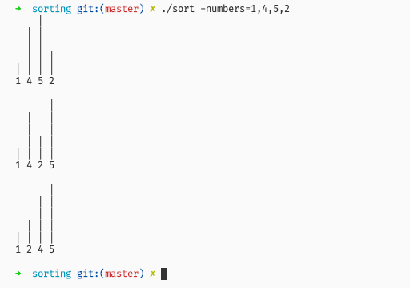

# Sorting and Visualization

Sorting list using insertion algorithm and display it as vertical bar chart.

## Build

you can build this source using Makefile by typing `make build` command or build using Go command: `go build -o sort .`

## Usages

|   | Flag    | Descriptions                                         |
|---|---------|------------------------------------------------------|
| 1 | output  | output file. if not set, default output is os.Stdout |
| 2 | numbers | number list, separated with comma. e.g. 1,3,4,2,3    |
| 3 | reverse | reverse list orders, default: false                  |

### Example

#### Display to terminal

```sh
./sort -numbers=1,4,5,2

# same as:
# ./sort -numbers="1, 4, 5, 2"
```

Output:



With reverse mode:


#### Export to File

```sh
./sort -numbers=1,4,5,2 -output=export.txt
```

Result:


